evernote-utils
==============

A collection of productivity-enhancing utilities for Evernote for Windows.

Developed for and tested with Evernote 5.0 on Windows 7.

Supported Use Cases
-------------------

Disclaimer: The implementation is tightly coupled to my broader Evernote-based GTD organizational system (TODO: link to description of my system).
It is meant to enhance **my own** productivity and efficiency using my system, which means some personalized behaviours within the code.
It should quite easy to modify my scripts to suit your needs, and anyone is encouraged to do so!

### Quick creation of a new "action-note" with Launchy

A fast way to create a new Evernote "action-note", no matter what's the active application, or whether Evernote application is open.

Call Launchy (Alt+Space) and start typing the "@action-context":
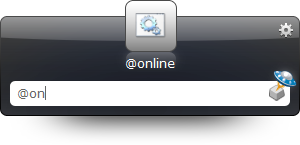

Once Launchy recognizes the context, hit "Tab" and type the note title:
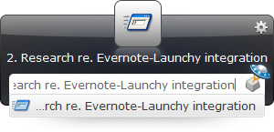

Then hit "Enter" - a new note will be created in a pre-determined notebook, tagged automatically based on the chosen action context and title syntax, and opened in a separate window ready for further editing (or closing):
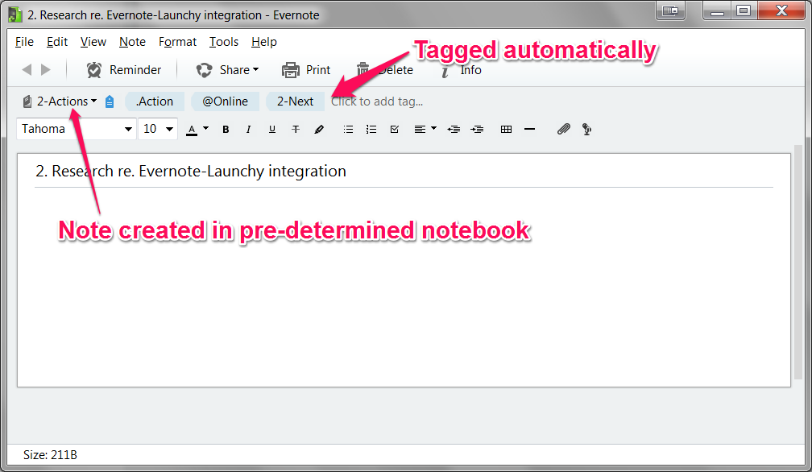


#### Specifying a different notebook in the title

The quick-note-creation script supports special syntax in the title for overriding default parameters, like the destination notebook for the new note.

By prefixing the note title with `/notebook:Target Notebook Name/` or `/project:Project-specific Notebook Name/`:
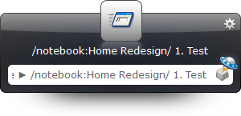

The note will be created directly in the specified notebook:
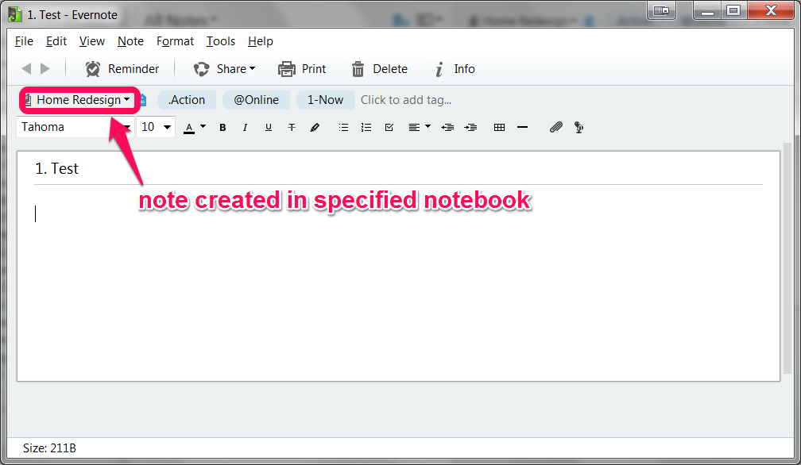

The script supports "lazy notebook lookup",
meaning it will try to select a notebook that matches the supplied string exactly,
but if there's no match, it will also try:

1. A maximal exact partial match: an existing notebook that contains the exact supplied string. if there are several such notebooks, it will select the one with the least unmatched strings before and after the matched string. 
2. A maximal word-overlap match: an existing notebook that has overlapping words with the supplied string. "words" are splitted on whitespace and "-". repeating words are counted only once. in case of multiple matched notebooks, it will select the one with the largest intersection.

All notebook lookups are case-insensitive.


#### Setting a reminder from the title

Similarly, it is also possible to prefix the note title with `/reminder:oct 3/` or `/tickle:next sunday, 10am/` in order to create a note with a reminder associated to it.

When specifying only a date:
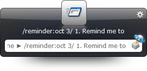

The note will be created with a reminder set to that date at 9am (can be modified [in the code](PyEvernote/ImportEvernoteTemplate.py#L16)):
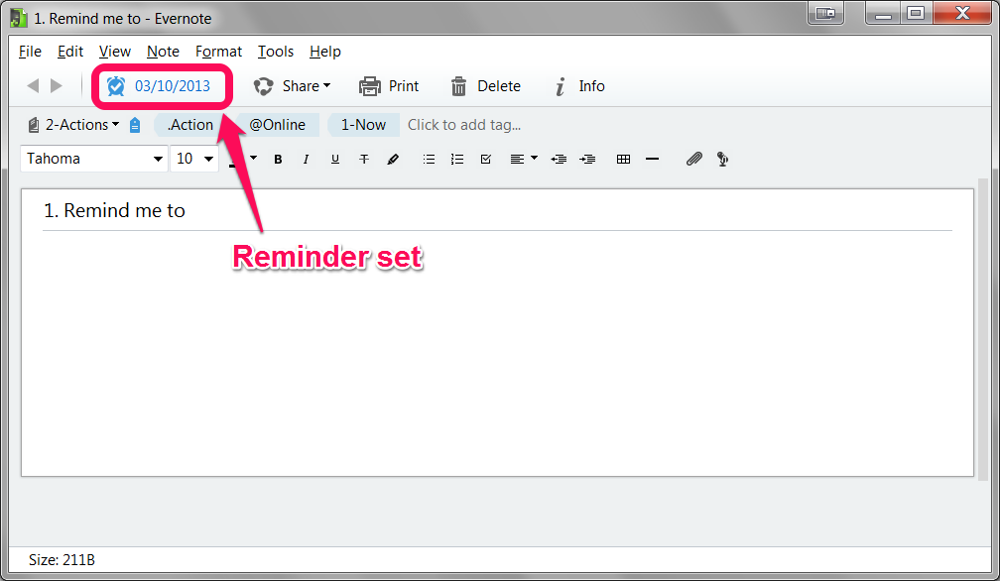


When specifying also a time:
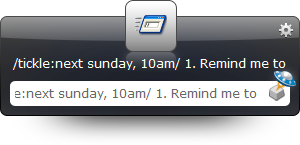

The reminder will be set to that time as well:
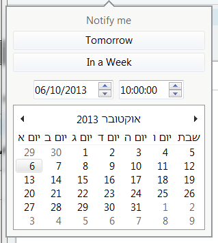

The script supports natural language date-time specification using [parsedatetime Python library](https://github.com/bear/parsedatetime),
so this is a dependency (install with `pip install parsedatetime`).

Note: The reminder time is calculated based on the current timezone.

In case the script was unable to parse the date, it will not set a reminder, but will prepend the note title with "FIX REMINDER" so you can see it was unable to set a reminder.


### Initialization of a new project in Evernote with Launchy or using a keyboard shortcut

Automate the process of initializing a new project in Evernote, where "project initialization" in my system includes:

1. Creating a project-specific notebook in a notebook stack.
2. Creating initial project notes in the new project notebook, based on a template.

Simply highlight in Evernote the target notebook-stack for the new project-notebook:


Call Launchy (Alt+Space) and start typing "enproject":
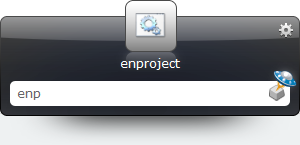

Hit "Tab" and type the name of the new project (which will also be the name of the project-specific notebook):
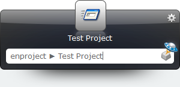

Hie "Enter", and behold the initialized project in the selected stack!
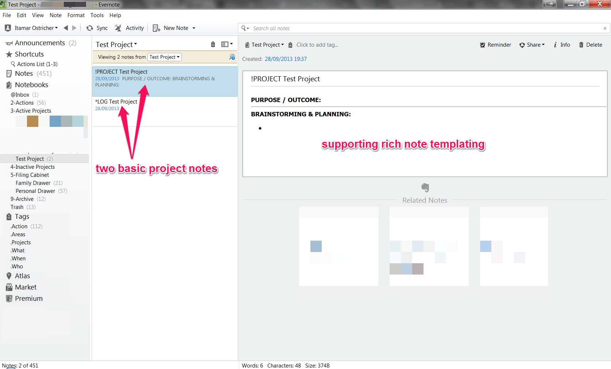

Alternatively, using [AutoHotKey](http://www.autohotkey.com/), you can bind a keyboard shortcut (e.g. "Ctrl+Alt+p", or "^!p") to the ["CreateProject.exe" executable](AHK) (which is a compiled version of the [AutoHotKey script](AHK/CreateProject.ahk)) to achieve something similar with AHK instead of Launchy.

Using the AHK method, you will type the project name in a popup dialog instead of the Launchy dialog:
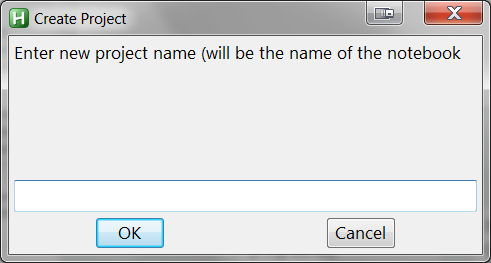

This, of course, requires that AutoHotKey is installed, and a keyboard shortcut is defined like this:

```AutoHotkey
#IfWinActive ahk_class ENMainFrame
	^!p::
		Run,"<package-dir>\AHK\CreateProject.exe"
#IfWinActive
```
 

Installation
------------

Requirements:

1. OS: Windows
2. Evernote >= 5.0
3. [Python 2.7](http://www.python.org/ftp/python/2.7.5/python-2.7.5.msi)
4. [parsedatetime Python library](https://github.com/bear/parsedatetime)
5. [Launchy](http://www.launchy.net/) (this probably works with other keyboard launchers, but the details will differ)
6. Optional: [AutoHotkey](http://www.autohotkey.com/) (needed if you want to change things, or bind custom keyboard shortcuts)

Steps:

1. [Download the package](https://github.com/itamaro/evernote-utils/archive/master.zip) (or [clone it](https://github.com/itamaro/evernote-utils.git)), and save it wherever you like on your computer (let's call that path `<package-dir>`).
2. Modify the scripts to fit your workflow and system (change default notebooks, tags, action contexts, note templates).
3. Configure Launchy to index batch script files from the [QuickNotes](QuickNotes) directory under `<package-dir>`:

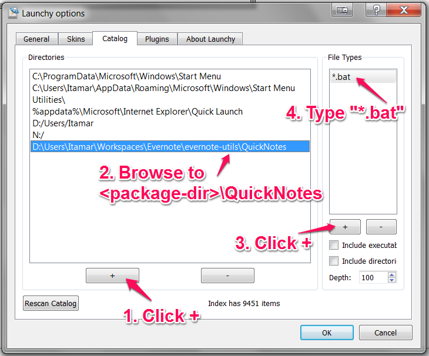
4. Click "Rescan Catalog" and "OK" to finish the process.

That's it!


Customization
-------------

TODO
